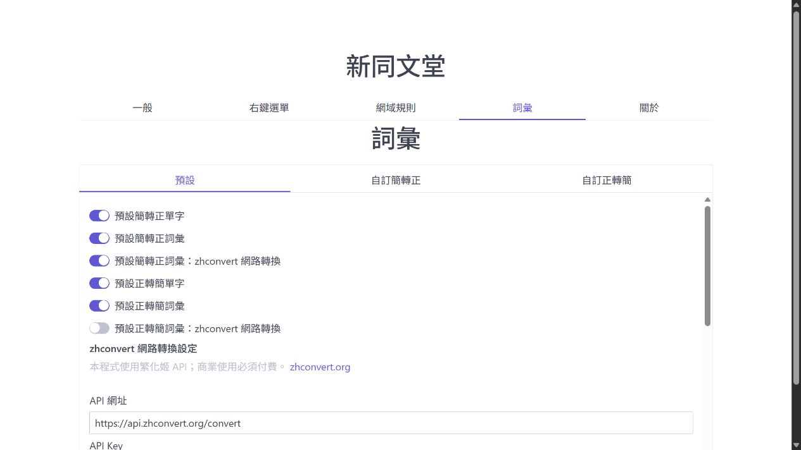
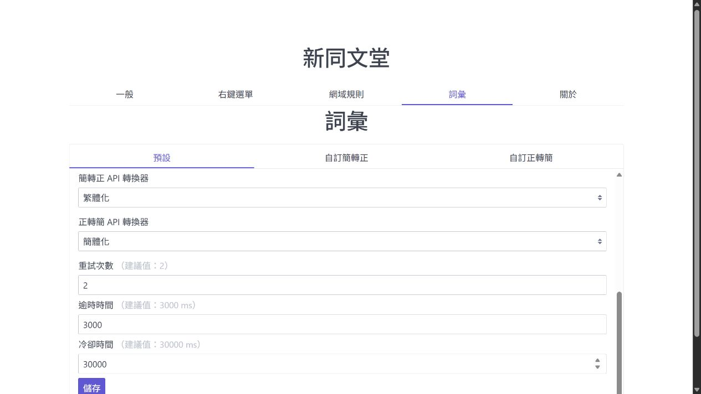

# 新同文堂


新同文堂是瀏覽器擴充功能，可在簡體中文與繁體中文之間轉換網頁內容、選取文字及剪貼簿內容。

## 主要功能

- 網頁內容轉換
  - 頁面載入時自動轉換。
  - 支援單頁應用程式（SPA）的動態內容轉換。
  - 透過瀏覽器工具列圖示或右鍵選單手動轉換。
  - 轉換剪貼簿內容。
- 詞彙管理
  - 啟用或停用內建單字、詞彙對應表。
  - 維護自訂簡轉正與正轉簡詞彙。
  - 可選擇使用 zhconvert 網路服務轉換預設詞彙。
- 網域規則
  - 以純文字或正規表示式指定自動轉換規則。
- 偏好設定
  - 匯入與匯出設定，並支援舊版設定格式。

## zhconvert 網路詞彙轉換

在「詞彙」→「預設」頁面啟用對應方向的「zhconvert 網路轉換」後，預設詞彙會先送至設定的 zhconvert API。網路請求失敗時，擴充功能會立即改用原有的本機詞彙轉換，避免中斷閱讀。





### 可調整設定

| 設定                 |                              預設值 | 說明                                     |
| -------------------- | ----------------------------------: | ---------------------------------------- |
| API 網址             | `https://api.zhconvert.org/convert` | 可指定相容的 API 端點。                  |
| API Key              |                                空白 | 以瀏覽器本機偏好設定儲存，並隨請求送出。 |
| 簡轉正／正轉簡轉換器 |         `Traditional`／`Simplified` | 可選擇繁化姬支援的轉換器。               |
| 重試次數             |                                 `2` | 每次請求最多嘗試次數，包含第一次請求。   |
| 逾時時間             |                           `3000 ms` | 單次 API 請求的逾時上限。                |
| 冷卻時間             |                          `30000 ms` | 連續失敗後暫停新的網路請求時間。         |

建議先使用預設值。連續失敗時會顯示一次低干擾通知，並在冷卻時間內直接走本機轉換；冷卻結束後才會再次嘗試網路服務。

本功能使用 [繁化姬 API](https://docs.zhconvert.org/api/0-getting-started/)，轉換端點依照 [`/convert` API 規格](https://docs.zhconvert.org/api/convert/) 傳送 `text` 與 `converter`。本程式使用繁化姬 API；商業使用必須付費，詳情請參閱 [zhconvert.org](https://zhconvert.org)。

## 下載

- [Firefox](https://addons.mozilla.org/firefox/addon/new_tongwentang/)
- [Chrome](https://chrome.google.com/webstore/detail/new-tongwentang/ldmgbgaoglmaiblpnphffibpbfchjaeg)
- [Microsoft Edge](https://microsoftedge.microsoft.com/addons/detail/%E6%96%B0%E5%90%8C%E6%96%87%E5%A0%82/ijddgmclgedepadbikmfekambhhfjfnl)

## 開發

### 安裝依賴

```powershell
npm install
```

### 開發模式

Firefox：

```powershell
npm run dev:firefox
```

Chromium 系列瀏覽器：

1. 複製 `.env.example` 為 `.env`。
2. 將 `CHROMIUM_BINARY` 設為 Chromium、Chrome 或 Edge 執行檔路徑。
3. 執行：

```powershell
npm run dev:chromium
```

### 驗證與正式建置

```powershell
npm run test:tsc
npx eslint .
npm run build:all
```

建置輸出位於 `dist/firefox` 與 `dist/chromium`。

## 文件

- [偏好設定（台灣繁體中文）](docs/preferences/preferences_zh-tw.md)
- [Preferences](docs/preferences/preferences.md)
- [授權項目（台灣繁體中文）](docs/permission/permission_zh-tw.md)
- [Permissions](docs/permission/permission.md)
- [建置說明](docs/build/readme.md)
